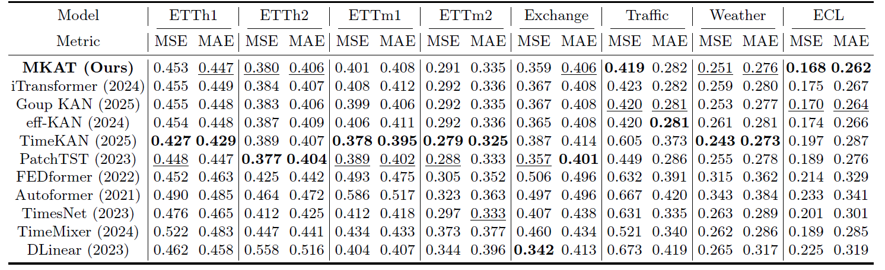
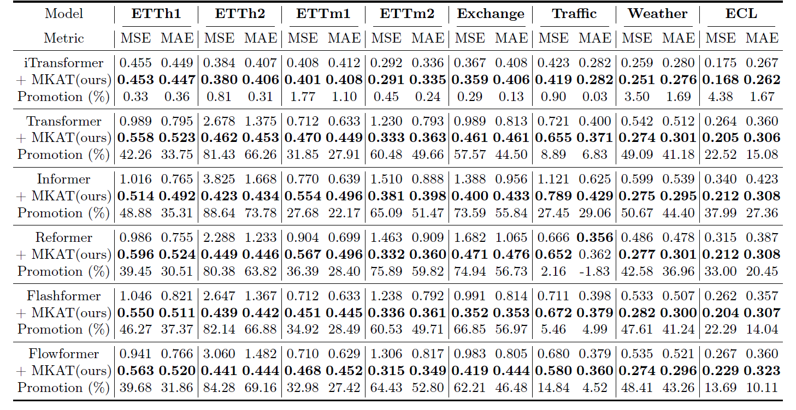
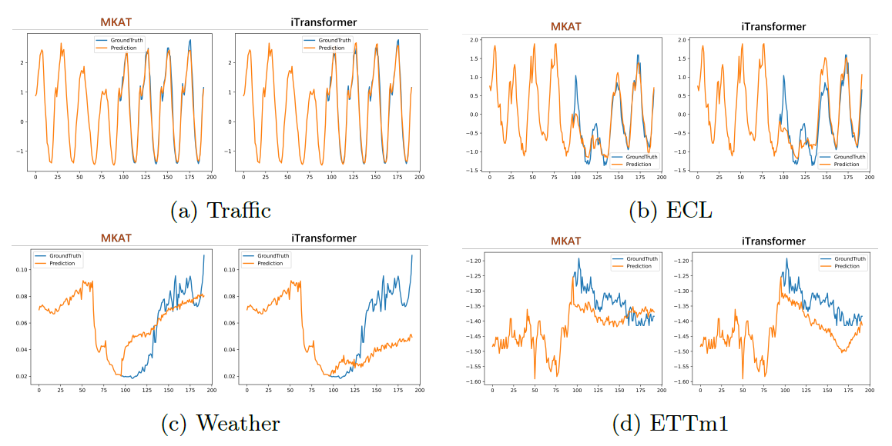

# MKAT-Mutual-Kolmogorov-Arnold-Transformer
The repo is the official implementation for the paper: **MKAT: [MKAT: Mutual Kolmogorov–Arnold Transformer for Reliable Information Flow in Long-Term Time Series Forecasting]** (paper link coming soon).

## Introduction
✅ Considering conventional models, including but not limited to Transformer-based architectures, typically fail to establish explicit connections across components and representation spaces, MKAT bridges these two often-overlooked aspects of Mutuality. Mutual Connect is all you need in MTSF

<p align="center">

</p>

💡 MKAT introduces a fundamentally new perspective and paradigm for structured information flow in contemporary models.

## Overview of MKAT Method

MKAT leverages the core InterComp KAN and this core-derived implicit coupling within the encoder to establish reliable inter-component information flow and reliable inter-space information flow.

<p align="center">

</p>


## Usage 

1. Install Pytorch and the necessary dependencies.

```
pip install -r requirements.txt
```

1. The datasets can be obtained from

2. Train and evaluate the model. Scripts corresponding to each experiment in the paper are organized under ./scripts/. You can reproduce the results by running the following examples:

```
# Multivariate forecasting with MKAT
bash .\scripts\Main_Result\ECL\MKAT_iTransformer.sh
```

The same pattern applies to other datasets and models.

> **Note on Hyperparameters:** The learning rates specified in the provided scripts are for reference only and may not correspond to the optimal values or those used to generate the reported results. Please tune the learning rate based on your specific hardware, batch size, and dataset configuration.

## 🔌 MKAT as a Plugin
We have distilled the core idea of MKAT into a lightweight, plug-and-play module. If you only want to integrate MKAT into your own models (without reproducing the full benchmark), please follow these steps:

1. Copy the kat_rational/ and torchkan/ folders into your project.
2. Refer to the MKAT-related implementations in the layers/ directory for usage examples and integration patterns.

> **Note:** The plugin is designed to be framework-agnostic and does not require the full Time-Series-Library environment. Only the above folders and their dependencies are needed.

## Main Result of Multivariate Forecasting

We evaluate MKAT with iTransformer as the backbone on widely-used multivariate time series forecasting (MTSF) benchmarks and compare it against state-of-the-art methods. **Comprehensive good performance** (MSE/MAE $\downarrow$) is achieved.

### Main Results from the Paper

<p align="center">

</p>

### General Performance Gains with MKAT on Transformer Variants

By introducing our proposed MKAT, Transformer and its variants achieve significant performance improvements. This demonstrates the generality of the reliable information flow established by MKAT, and we hypothesize that this principle extends beyond Transformers to potentially benefit a broader range of architectures.

<p align="center">

</p>

### Visualization: Adaptive Changes via Reliable Information Flow

<p align="center">

</p>

## Citation

If you find this repo helpful, please cite our paper. Citation will be available soon.

<!-- TODO: Update with the official BibTeX entry once the preprint is released -->

## Acknowledgement

We appreciate the following GitHub repos a lot for their valuable code and efforts.
- iTransformer (https://github.com/thuml/iTransformer)
- KAT (https://github.com/Adamdad/kat)
- Reformer (https://github.com/lucidrains/reformer-pytorch)
- Informer (https://github.com/zhouhaoyi/Informer2020)
- FlashAttention (https://github.com/shreyansh26/FlashAttention-PyTorch)
- Time-Series-Library (https://github.com/thuml/Time-Series-Library)
- eff-KAN (https://github.com/Blealtan/efficient-kan)
- TimeKAN (https://github.com/huangst21/TimeKAN)

## Contact

If you have any questions or want to use the code, feel free to contact:
* Yihuang Chen (2023211971@stu.cqupt.edu.cn)
* Yihuang Chen (3221855942@qq.com)

> **Note:** If you do not receive a reply from the university email within a few days, please try the alternative email above.
