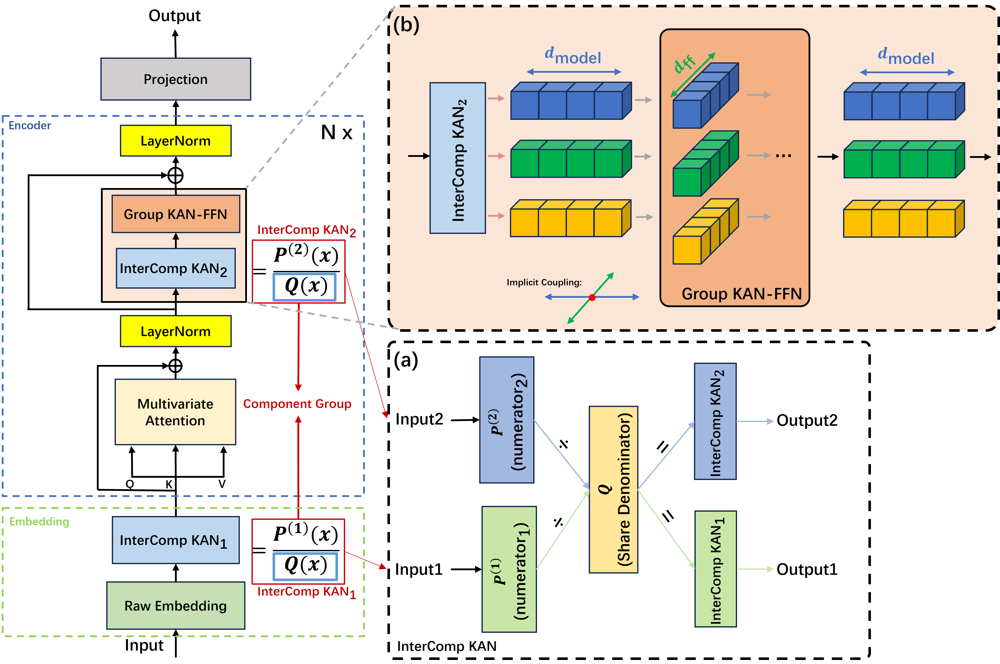

# MKAT-Mutual-Kolmogorov-Arnold-Transformer
The repo is the official implementation for the paper: **MKAT: [MKAT: Mutual Kolmogorov–Arnold Transformer for Reliable Information Flow in Long-Term Time Series Forecasting]** (paper link coming soon).

## Introduction
✅ Considering conventional models, including but not limited to Transformer-based architectures, typically fail to establish explicit connections across components and representation spaces, MKAT bridges these two often-overlooked aspects of Mutuality. Mutual Connect is all you need in MTSF

<p align="center">

</p>

💡 MKAT introduces a fundamentally new perspective and paradigm for structured information flow in contemporary models.

## Overview of MKAT Method

MKAT leverages the core InterComp KAN and this core-derived implicit coupling within the encoder to establish reliable inter-component information flow and reliable inter-space information flow.

<p align="center">

</p>


## Usage 

1. Install Pytorch and the necessary dependencies.

```
pip install -r requirements.txt
```

1. The datasets can be obtained from

2. Train and evaluate the model. Scripts corresponding to each experiment in the paper are organized under ./scripts/. You can reproduce the results by running the following examples:
